# Starbucks Capstone Challenge

### Introduction

This data set contains simulated data that mimics customer behavior on the Starbucks rewards mobile app. Once every few days, Starbucks sends out an offer to users of the mobile app. An offer can be merely an advertisement for a drink or an actual offer such as a discount or BOGO (buy one get one free). Some users might not receive any offer during certain weeks. 

Not all users receive the same offer, and that is the challenge to solve with this data set.

Your task is to combine transaction, demographic and offer data to determine which demographic groups respond best to which offer type. This data set is a simplified version of the real Starbucks app because the underlying simulator only has one product whereas Starbucks actually sells dozens of products.

Every offer has a validity period before the offer expires. As an example, a BOGO offer might be valid for only 5 days. You'll see in the data set that informational offers have a validity period even though these ads are merely providing information about a product; for example, if an informational offer has 7 days of validity, you can assume the customer is feeling the influence of the offer for 7 days after receiving the advertisement.

You'll be given transactional data showing user purchases made on the app including the timestamp of purchase and the amount of money spent on a purchase. This transactional data also has a record for each offer that a user receives as well as a record for when a user actually views the offer. There are also records for when a user completes an offer. 

Keep in mind as well that someone using the app might make a purchase through the app without having received an offer or seen an offer.

### Example

To give an example, a user could receive a discount offer buy 10 dollars get 2 off on Monday. The offer is valid for 10 days from receipt. If the customer accumulates at least 10 dollars in purchases during the validity period, the customer completes the offer.

However, there are a few things to watch out for in this data set. Customers do not opt into the offers that they receive; in other words, a user can receive an offer, never actually view the offer, and still complete the offer. For example, a user might receive the "buy 10 dollars get 2 dollars off offer", but the user never opens the offer during the 10 day validity period. The customer spends 15 dollars during those ten days. There will be an offer completion record in the data set; however, the customer was not influenced by the offer because the customer never viewed the offer.

### Cleaning

This makes data cleaning especially important and tricky.

You'll also want to take into account that some demographic groups will make purchases even if they don't receive an offer. From a business perspective, if a customer is going to make a 10 dollar purchase without an offer anyway, you wouldn't want to send a buy 10 dollars get 2 dollars off offer. You'll want to try to assess what a certain demographic group will buy when not receiving any offers.

### Final Advice

Because this is a capstone project, you are free to analyze the data any way you see fit. For example, you could build a machine learning model that predicts how much someone will spend based on demographics and offer type. Or you could build a model that predicts whether or not someone will respond to an offer. Or, you don't need to build a machine learning model at all. You could develop a set of heuristics that determine what offer you should send to each customer (i.e., 75 percent of women customers who were 35 years old responded to offer A vs 40 percent from the same demographic to offer B, so send offer A).

# Data Sets

The data is contained in three files:

* portfolio.json - containing offer ids and meta data about each offer (duration, type, etc.)
* profile.json - demographic data for each customer
* transcript.json - records for transactions, offers received, offers viewed, and offers completed

Here is the schema and explanation of each variable in the files:

**portfolio.json**
* id (string) - offer id
* offer_type (string) - type of offer ie BOGO, discount, informational
* difficulty (int) - minimum required spend to complete an offer
* reward (int) - reward given for completing an offer
* duration (int) - time for offer to be open, in days
* channels (list of strings)

**profile.json**
* age (int) - age of the customer 
* became_member_on (int) - date when customer created an app account
* gender (str) - gender of the customer (note some entries contain 'O' for other rather than M or F)
* id (str) - customer id
* income (float) - customer's income

**transcript.json**
* event (str) - record description (ie transaction, offer received, offer viewed, etc.)
* person (str) - customer id
* time (int) - time in hours since start of test. The data begins at time t=0
* value - (dict of strings) - either an offer id or transaction amount depending on the record

# Data exploration

## Ofers
There is 3 kind of offers and the channels rewards and dificulty is tisted below

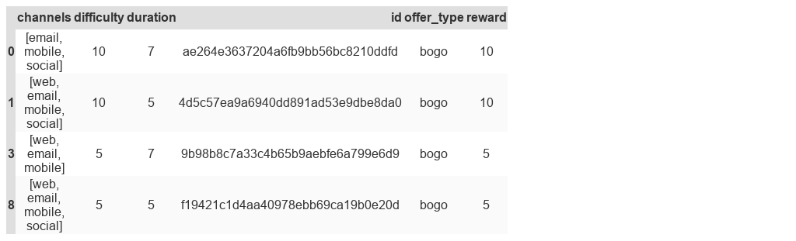
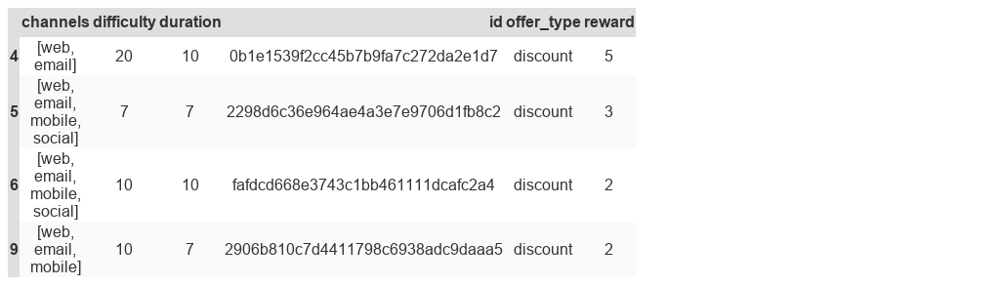
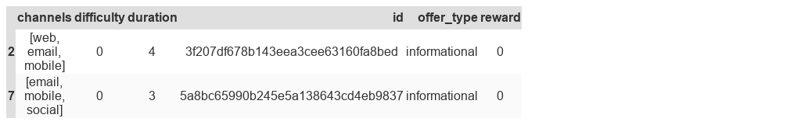

## Distribution of customer age

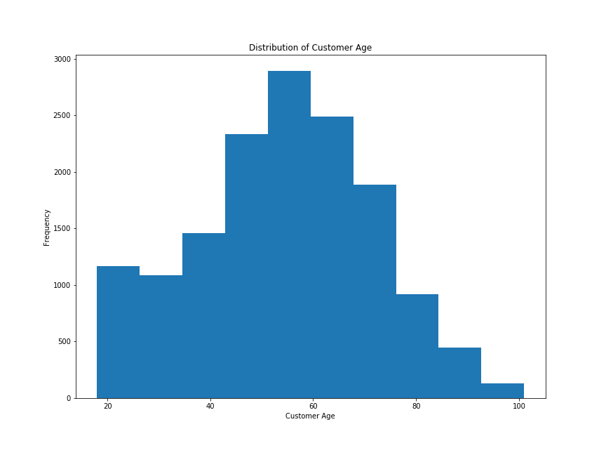

As we can see the majority of the users is between **40-65** followed by the range 20-40

## User as a client

Below is the distribution of users in days since they sign-up (it is assumed to do the calculus that the last day is the last day of the dataset)

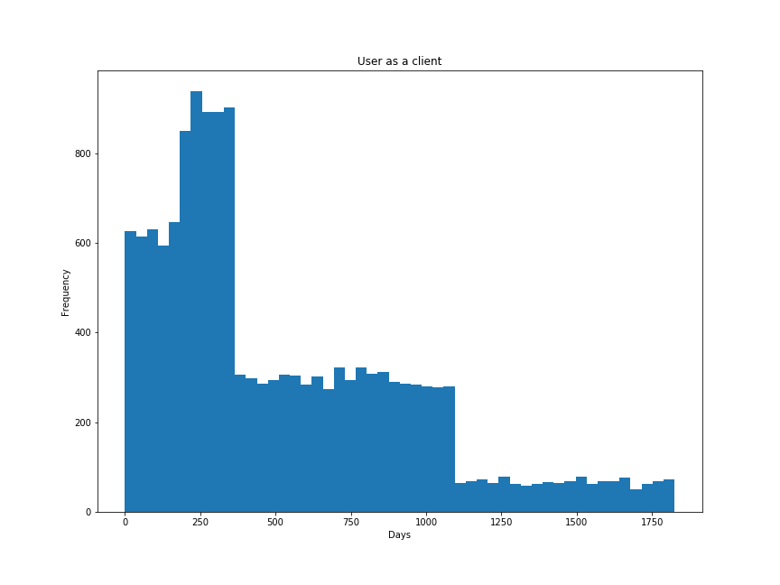

As we can see the majority of the users are the ones who have ben user for **250-400** days

## The distribution of user's income

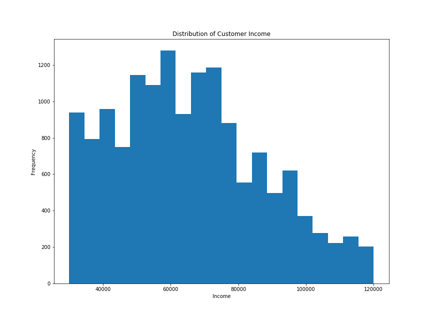

The usual user income is from **30k to 65k**

# Insights

Insights about the completed offers, the income of the users who completed offers and completed offers by gender

**Completed Offers**

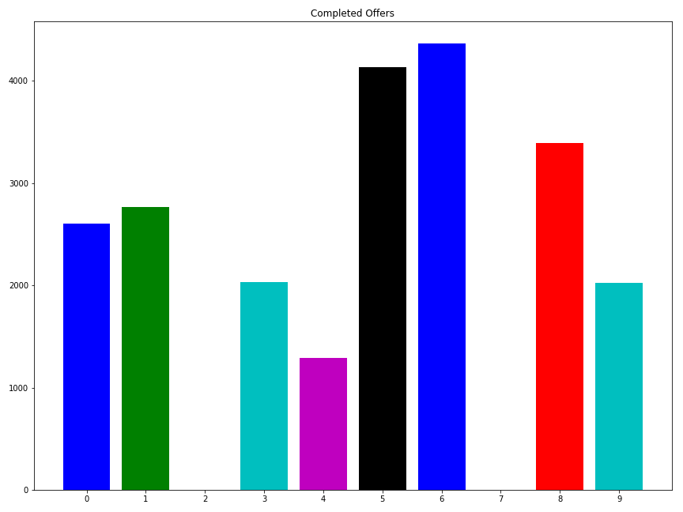

As you can see the more completed offers are:
- Discount with rewad 3
- Discount with reward 2

_Both are on web, email, mobile and social channels (All the available channels)_ 

The bogo type is the second top, with the half completed ofers more or less

**Income of completed offers**

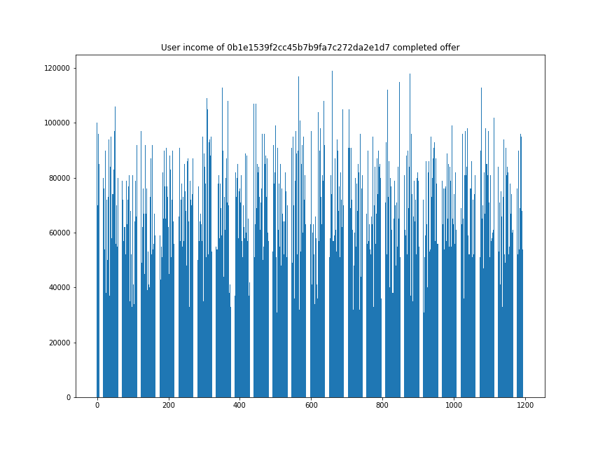
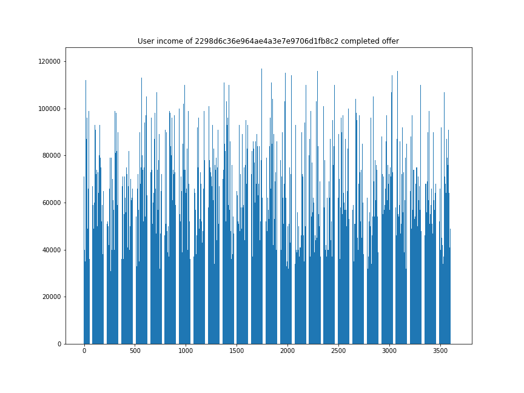
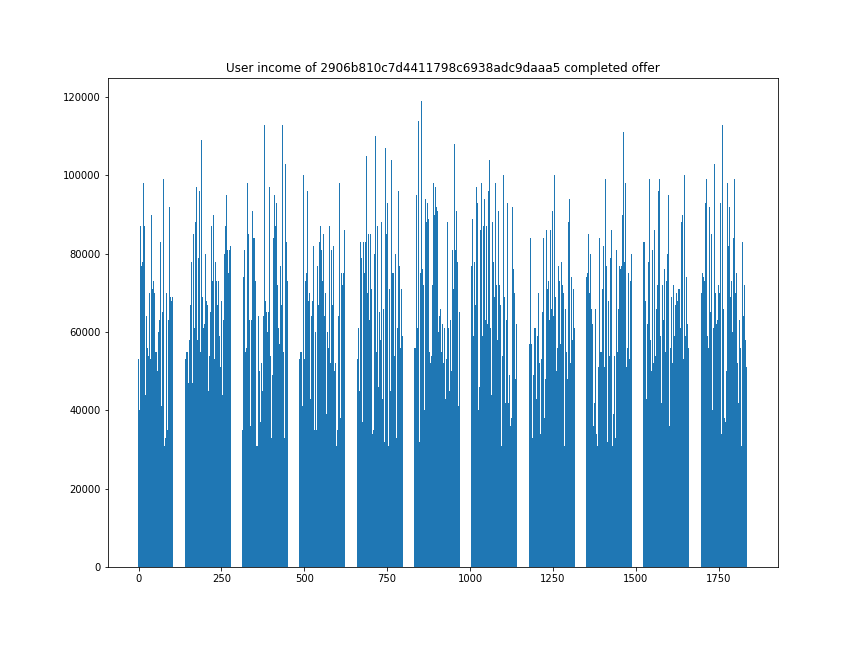
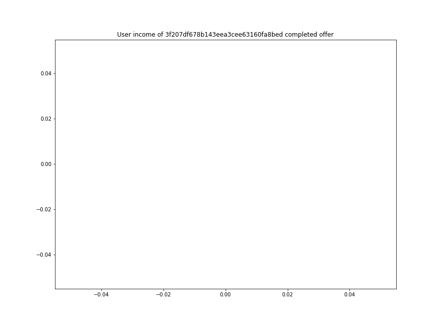
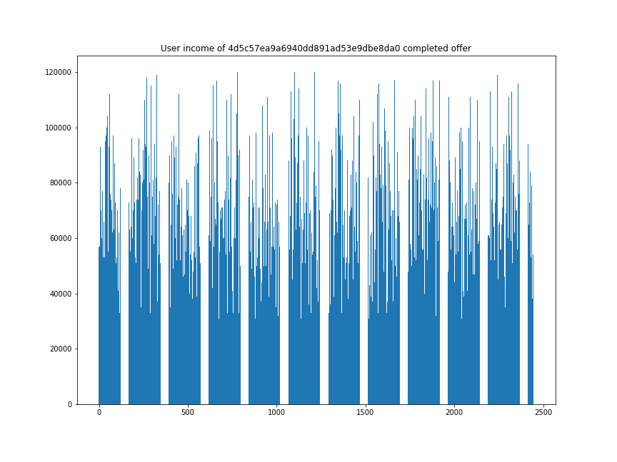
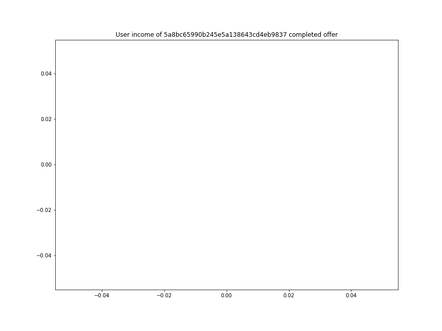
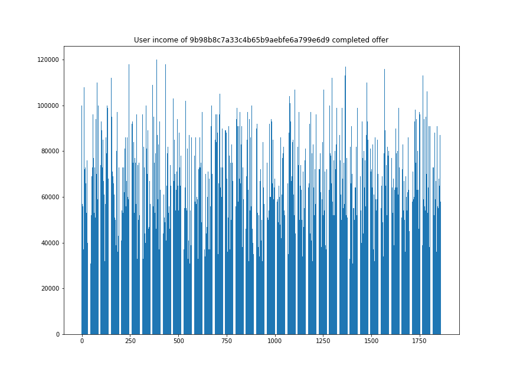
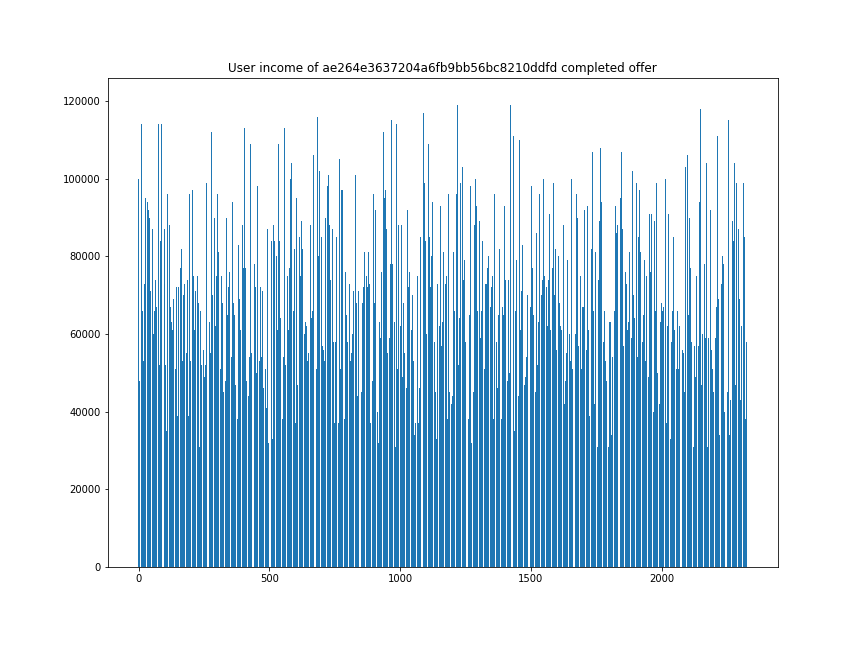
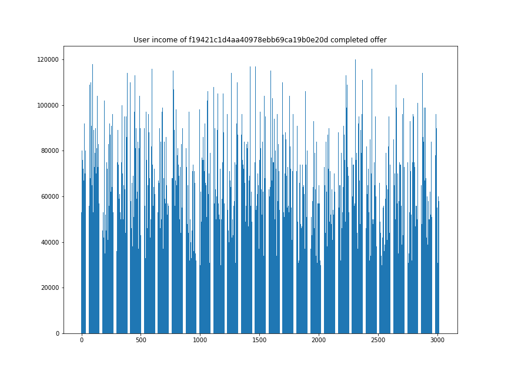
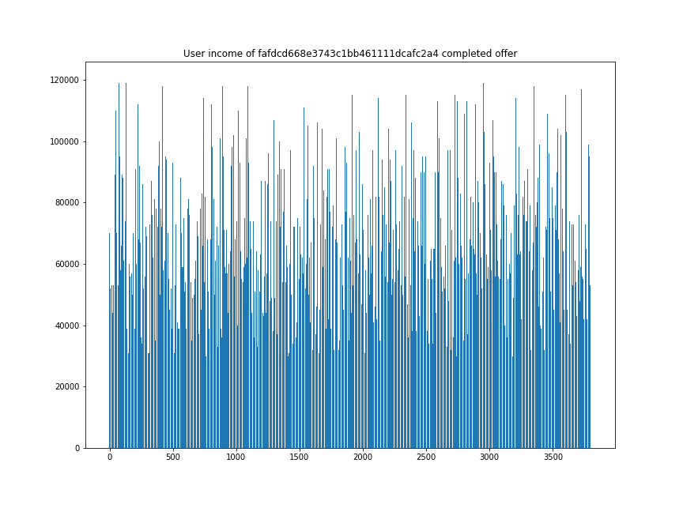

There isnt any remarkable value about the income of the completed offers

**Completed offers by gender**

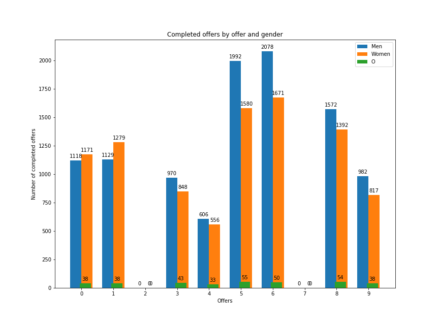

On the 3 top completed offers there are more men than womem like almost all the offers except onthe BOGO ones who there are slightly more women than men

The _Others_ gnere are underrepresentated 

# Data preparation

To process all the information of the tranactions a user-offer matrix has been made.

This matrix get the information of the transcript and encode how much times a user has recived, view or completed an offer

A real_complete column is added because an user can complete an offer without seing it, so in order to get a value in the real_complete column the user had to recived, viewed and complete an offer in that order.

It looks like this

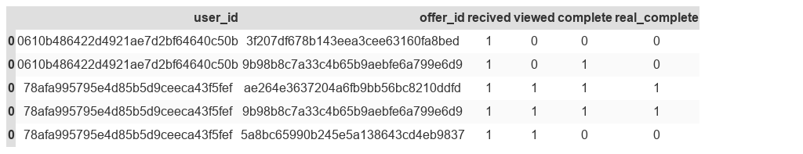

Once there is a matrix correlating the users and the offers we can model the data to the training

The data that is used for training will be:

- age
- gender
- income
- days a user has been a user

The age, income and user_day will be normalized and the gender will be one-hot-encoded

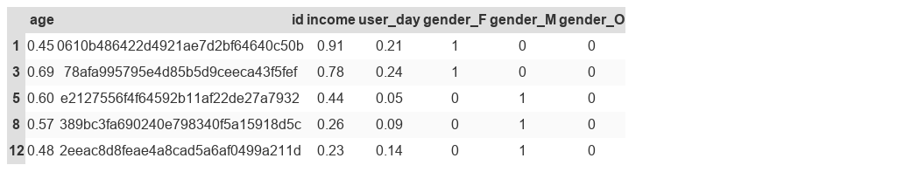

For the labels 3 encodeds are going to be made:

- 1) A one hot encoded user with the completed offers
    - 1.1)  the one hot encoded has also the number of completed offers
- 2) The label with the maximum reward

As the previous datasets were not giving good results, the problem and the input were re-engineered. In this case, merging the offers data in the independent variables along with the demographic features is chosen so a binary classifier is made, this classifier specifies either the offer will be successful (viewed and completed) or not successful (ignored).

- 4) Demographic features + hot-encoded completed offers

**1)**

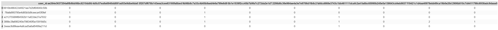

**1.1)**

**2)**

For each user you get the completed offers
for those offers you get the rewards
The label is choosed with the max of all completed rewards

For example if an offer with a reward of 5 is compoleted 2 times it will be choosed before a completed offer with a reward of 5 completed 1 time

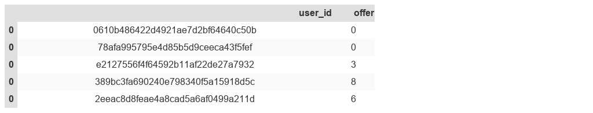

**4)**

## Train

The training aims to get an offer using as input:

- age
- gender
- income
- days a user has been a user

The train will be diferenciate by dataset because this problem can be solved as **multi-label** or **multiclass**:

- multiclas: in multi-class problems the classes are mutually exclusive
- multi-label: in multi-label problems each label represents a different classification task, but the tasks are somehow related (so there is a benefit in tackling them together rather than separately)

### **1)**

Custon ann (pytorch implementation)

6 inputs 2 hidden layers (16,32) and 10 oputputs as there is 10 different offers

- criterion -->Binary Cross Entropy between the target and the output (BCELoss)
- optimizer --> Adam

**Test loss: 0.3696391788351165**

### 1.1)

For this approach that only has the offers one-hot encoded different clasifiers had been testd using a gaussian naive bayes base classifier

| Clasifier | BinaryRelevance     | ClassifierChain     | LabelPowerset          | MLkNN         |
|-----------|---------------------|---------------------|------------------------|---------------|
| Score     | 0.31062394603709947 | 0.31062394603709947 | 0.00033726812816188871 | 0.31197301855 |

### 2)

**Custon ann (pytorch implementation)**

6 inputs 2 hidden layers (16,32) and 1 oputputs the top rewarded offer by user

- criterion -->Binary Cross Entropy between the target and the output (BCELoss)
- optimizer --> Adam

Test loss: 0.45583873448677675

**xgboost clasifier**

   precision    recall  f1-score   support

          0       0.41      0.97      0.58      1209
          1       0.20      0.02      0.04       423
          3       0.17      0.01      0.01       198
          4       0.00      0.00      0.00       109
          5       0.12      0.01      0.02       313
          6       0.26      0.02      0.03       275
          8       0.38      0.01      0.02       349
          9       0.00      0.00      0.00        89

avg / total       0.29      0.40      0.25      2965

## Second Training

As the previous solutions didn't get good results a new training is made, this training  has as input the demographic inputs and the offers' ids so the total input is the features and the offer that is going to be tested.

The output will be if the offer will be completed or not

So a binary clasifier is going to be build

**xgboost clasifier**

After re-engineer the problem changing the input and making it a binary clasifier the values for the score are goods.

             precision    recall  f1-score   support

        0.0       0.88      1.00      0.94     26068
        1.0       0.00      0.00      0.00      3582

avg / total       0.77      0.88      0.82     29650

# Conclusion

The models do not perform well in this clasification task using choosen input, although all clasifiers gives the same score

For the ann an exploratory could been made with the **loss function and the activation function used in the output layer**.

For this kind of problems **traditional machine learning algorithms such as gradient boosting techniques (XGBoost, LightGBM..etc) will get better results and performance.**

If you have issues related to the solution to the problem a **re-engineer should be considered** in this case the problem was changed to a **binary clasifier** that tells if a certain user (**only using its demographic values**) will complete the offer or not

# Code

- **exploration.ipynb**
    - Data exploration 
    - user_offer_matrix
- **completed_offers.ipynb**
    - Insights abour offers
    - Data preparation
- **train.ipynb**
    - ML algorithms
